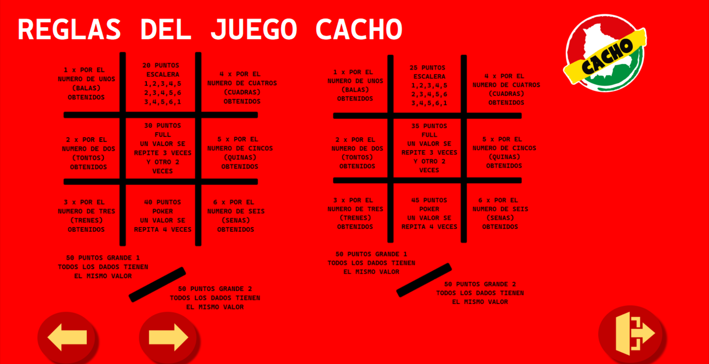

# Cacho - Juego de Dados en C++

## Descripción
Cacho es un juego boliviano de dados, este proyecto lo simulamos en C#. El juego se ejecuta con la Aplicacion de Windows Forms (.NET FRAMEWORK) y permite a dos o mas jugadores competir lanzando dados para obtener la mejor puntuación.

## Características
- Dos o mas jugadores pueden participar.
- Interfaz en una ventana de Windows
- Uso de dados y reglas del juego Cacho.

## Instrucciones de Uso
1. Compila el código utilizando Aplicacion de Windows Forms (.NET FRAMEWORK).
2. Ejecuta el programa y espera a que aparezca la ventana.
3. Sigue las instrucciones para jugar y disfrutar del juego.

## Dependencias
El juego utiliza las bibliotecas estándar de C# con la Aplicacion de Windows Forms (.NET FRAMEWORK).

## Imagenes

    
    

## Licencia
Este proyecto está bajo la Licencia MIT. Consulta el archivo [LICENSE](LICENSE) para obtener más detalles.

---

¡Diviértete jugando Cacho!
